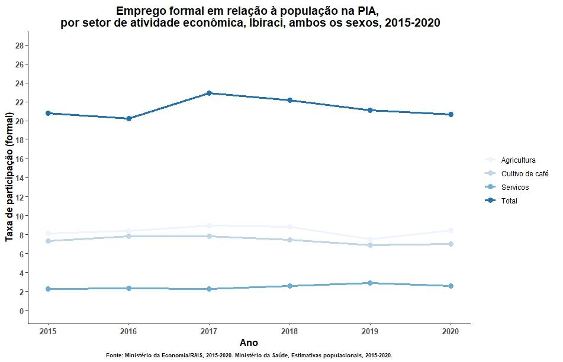

# rais_municipios.Rproj

<!-- badges: start -->
<!-- badges: end -->

The goal of rais_municipios.Rproj is to import and analyze formal work labor in some municipalities in Brazil. This work is inside of a diagnosis that we are making by the Fundação João Pinheiro (FJP/MG/Brazil) in partnership with International Labor Organization (ILO).

The indicator that we are measuring here is the relationship between formal labor in some activities related to the coffee chains and the Age Active Population (projected by Healthy Ministery, Brazil). For the formal labor, we are using data from "Relação Anual de Informação Social (RAIS, Economic Ministery)."

An example can be visualized below.

